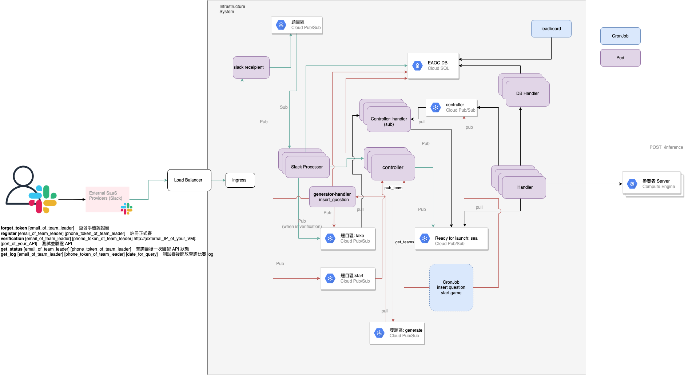

<p align="center">
  <a href="./README.md"> English </a> | <a href="./README.zh-TW.md"> 繁體中文


<p align="center">
  <target="_blank">
    
  </a>
</p>

<p align="center">
  Developed by E.SUN COMMERCIAL BANK, LTD.
  <br>
  <br>
</p>


[](https://www.gnu.org/licenses/lgpl-3.0)
[](https://www.python.org/downloads/release/python-370/)


# AI_arena

AI_arena is an API scoring system, which allows people who want to build a Machine Learning API competition to use this system to establish a complete set of mechanisms for contestant identity authentication, API server authentication, and API request issuance.

## Requirements
This system needs to use Google Cloud Platform related components to complete the construction. Contains GKE, cloud logging, GCS, etc.
Front end uses slack as user interface.

## Prerequisites
- GCP uses the service account json file of the relevant component
- Prepare a slack workspace and add a slack app
- Create Pub/Sub topics
  - generator-{env}
  - controller-{env}
  - lake-{env}
  - sea-{env}
  - slack-msg-{env}


## System Structure

## Getting Started
0. Initialize a GKE cluster, cloudSQL.
1. Go to each folder ai_arena build dockerfile, and push to the corresponding Container Registry.

```
cd ai_arena/<each component name>
docker build -t <Container Registry>/<image name>/
```
2. Place the json file and related parameters in chart/Values.yml
3. Go to chart/
```
helm install ai-arena .
```

## License
```
Copyright (C) 2022  E.SUN BANK.

This program is free software: you can redistribute it and/or modify it under the terms of the GNU General Public License as published by the Free Software Foundation, either version 3 of the License, or (at your option) any later version.

This program is distributed in the hope that it will be useful,but WITHOUT ANY WARRANTY; without even the implied warranty of MERCHANTABILITY or FITNESS FOR A PARTICULAR PURPOSE.  See the GNU General Public License for more details.

```